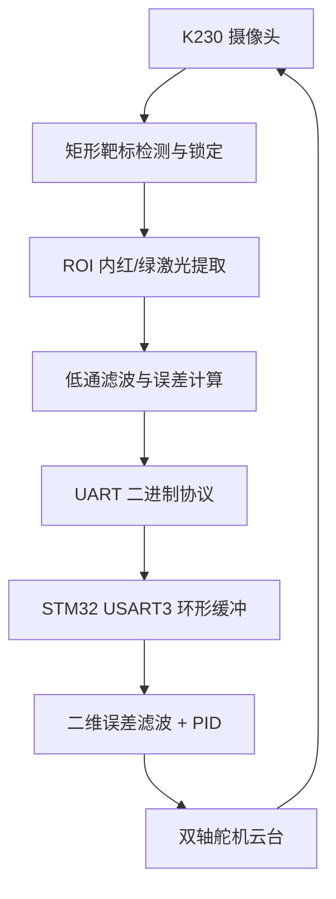

# K230 + STM32 红绿激光视觉追踪系统

> K230 检测矩形靶标和红/绿激光点，STM32F103RC 解析二维像素误差并驱动双轴舵机云台，实现绿色激光对红色目标点的闭环追踪。

## 项目简介

本项目采用异构双控制器架构：

- **K230 视觉端**：检测并稳定锁定矩形靶标，在 ROI 内分别提取红、绿激光光斑，经过低通滤波后计算两者的像素误差；
- **STM32 控制端**：通过 USART3 接收二进制误差帧，对误差再次滤波并运行双轴增量式 PID，输出双轴舵机脉宽；
- **执行机构**：二维舵机云台改变绿色激光方向，使其逐步与红色光点重合。

## 系统架构



## 核心功能

- 320×240 图像采集
- 矩形靶标筛选、连续稳定判断和锁定
- 靶标 ROI 限定，减少背景干扰
- LAB 阈值分割红/绿激光点
- 光斑面积和尺寸过滤
- 一阶低通滤波
- 8 字节二进制误差帧与校验和
- STM32 USART3 中断 + 环形缓冲
- X/Y 双轴 PID、死区、积分限幅与单帧步长限制
- 激光丢失帧与动态项复位

## 通信协议

K230 向 STM32 发送固定 8 字节：

| 字节 | 含义 |
|---:|---|
| 0 | 帧头 `0xFF` |
| 1 | 命令：`0x01`有效误差，`0x02`目标丢失 |
| 2–3 | `error_x`，有符号 int16，大端 |
| 4–5 | `error_y`，有符号 int16，大端 |
| 6 | 命令与 4 个数据字节累加和低 8 位 |
| 7 | 帧尾 `0xFE` |

串口参数：`115200 bit/s`、8N1。

## 核心接线

| K230 | STM32F103RC | 说明 |
|---|---|---|
| Pin 9 / UART1_TX | PC11 / USART3_RX | 误差帧，必接 |
| Pin 10 / UART1_RX | PC10 / USART3_TX | 调试回传，可选 |
| GND | GND | 必须共地 |

STM32 使用 USART3 部分重映射到 PC10/PC11。双轴舵机使用软件 PWM：

| STM32 引脚 | 作用 |
|---|---|
| PA0 / Servo J1 | X 轴舵机 |
| PA1 / Servo J2 | Y 轴舵机 |

> K230 引脚编号是脚本中的 FPIOA 编号，实际排针位置必须参考所用 K230 板卡丝印。激光器和舵机应使用合适电源，所有逻辑模块共地。

## 快速开始

### K230

1. 将 `zonghe333.py` 部署到支持该 `media.sensor` API 的 K230 环境；
2. 确认摄像头、显示输出和 UART 引脚；
3. 根据现场光照重新标定红/绿 LAB 阈值；
4. 运行脚本，观察矩形锁定、光斑和误差输出。

### STM32

1. 使用 Keil 打开 `stm32_3/USER/steer_freeII.uvprojx`；
2. 确认目标器件和下载器；
3. 先不连接激光机械负载，烧录后观察舵机 PWM；
4. 连接 USART3 与 K230；
5. 低速、限幅状态下完成双轴方向验证。

详细内容见 [项目技术指南](docs/PROJECT_GUIDE.md)。

## 仓库结构

```text
├── zonghe333.py              # K230 视觉识别、滤波与发帧
├── video                     # 项目演示素材
├── stm32_3/
│   ├── USER/main.c           # STM32 入口
│   ├── USER/control.c        # 协议解析与双轴 PID
│   ├── BSP/bsp_usart.c       # USART 与环形缓冲
│   ├── BSP/bsp_servo.c       # 舵机软件 PWM
│   └── USER/steer_freeII.uvprojx
└── docs/PROJECT_GUIDE.md
```

## 关键参数

| 参数 | 当前值 |
|---|---:|
| 检测分辨率 | 320×240 |
| 矩形稳定次数 | 3 |
| 激光低通系数 | 0.25 |
| K230 丢失计数阈值 | 5 |
| STM32 误差死区 | X/Y 均 3 px |
| PID | Kp 0.25、Ki 0.003、Kd 0.08 |
| 最大单帧舵机变化 | 8 μs |

这些值来自当前源码，只是已有配置，不代表已经取得统一场景下的最优性能。

## 安全说明

- 激光器可能伤害眼睛，调试时禁止直视光束，并使用合适防护；
- 首次测试不要让云台指向人员、镜面或高反射物；
- 舵机必须设置机械限位，防止 PID 积累导致撞限位；
- 先验证单轴方向，再启用闭环；
- 当前项目用于教学与原型验证，不适用于安全关键场景。

## License

仓库当前未声明开源许可证。未经作者明确授权，默认保留全部权利。
