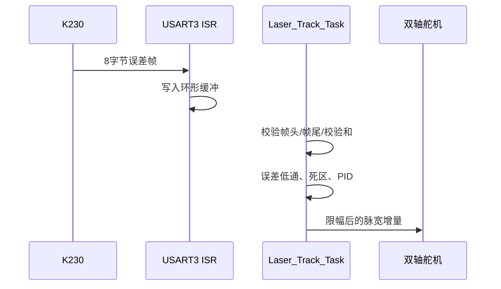

# 项目技术指南

## 1. K230 视觉流程

1. 初始化摄像头、显示与 UART1；
2. `find_rects()` 搜索候选矩形；
3. 按尺寸、比例、中心和 magnitude 过滤；
4. 连续检测到相似矩形 3 次后锁定；
5. 根据矩形角点生成带边距的 ROI；
6. 分别搜索红、绿光斑；
7. 过滤过大光斑并选择最佳候选；
8. 对坐标做一阶低通；
9. 发送 `red - green` 的 X/Y 误差；
10. 连续丢失时发送 LOST 帧。

## 2. STM32 控制流程

`control.c` 只处理缓冲区中最新的一帧，避免历史数据造成明显控制延迟。PID 输出不是绝对角度，而是每帧叠加的 PWM 偏移，并受到积分范围、总偏移和单帧步长限制。

## 3. 方向与标定

- `SERVO_X_DIR`、`SERVO_Y_DIR` 控制正负方向；
- `SERVO_*_OFFSET_MIN/MAX` 限制总偏移；
- `SERVO_MAX_STEP_*` 限制每帧变化；
- `LASER_DEAD_ZONE_*` 决定允许的像素误差。

若闭环发散，立即停止，优先反转对应 `SERVO_*_DIR`，不要先增大 PID。

## 4. 联调步骤

1. 只运行 K230，确认矩形锁定和光斑识别；
2. 用串口工具捕获 8 字节帧并验证校验；
3. STM32 端先固定舵机中位；
4. 手动给出小误差帧验证 X/Y 方向；
5. 启用单轴闭环；
6. 再启用双轴并逐步调参。

## 5. 常见问题

| 现象 | 排查 |
|---|---|
| 矩形无法锁定 | 梯度阈值、尺寸、比例、光照 |
| 红/绿光斑找不到 | LAB 阈值、曝光、ROI、反光 |
| STM32 无数据 | Pin9→PC11、共地、115200 8N1 |
| 校验失败 | 字节序、丢字节、帧头重同步 |
| 云台持续发散 | 舵机方向符号 |
| 接近目标仍抖动 | 死区、滤波系数、Kp/Kd |
| 目标丢失后异常 | LOST 帧和丢失计数 |

## 6. 推荐实验指标

后续可记录但不要在无实测时宣称：

- 像素稳态误差；
- 角度或靶面物理误差；
- 单帧视觉耗时；
- 通信帧率与丢包率；
- 目标阶跃响应时间；
- 超调量和稳态抖动。
